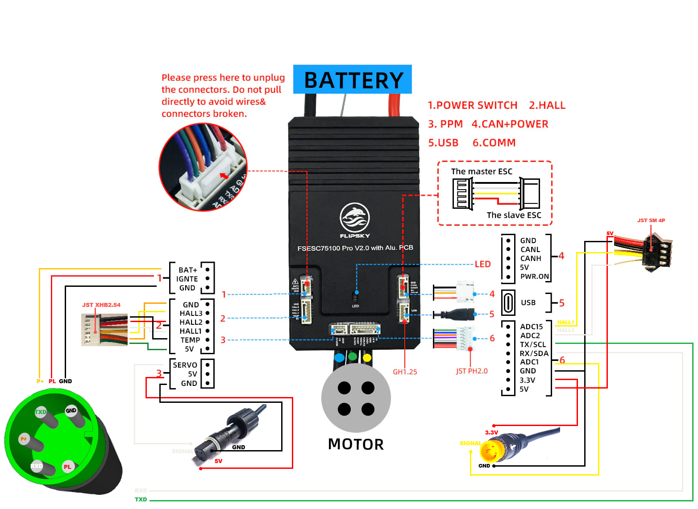
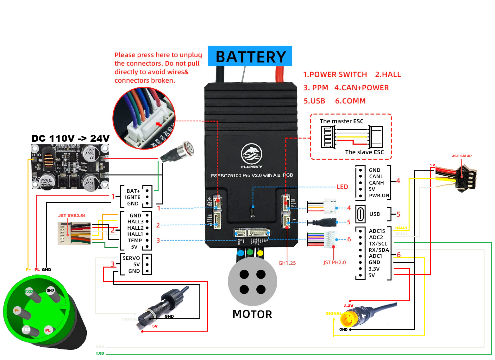

# BBSHD Flipsky 75100/75200 PRO V2 firmware

This is a VESC based firmware to control your Flipsky BBSHD ebike build. It adds a bunch of bike features on top of bare VESC implementation.

## The FW features

* Bafang uart display support
    * Max current scale depending on PAS assist level
    * Battery SOC available even on 72V builds
    * Can display motor temperature instead of speed (unfortunately will work well only for displays configured to show kmh)
* Wheel speed sensor
    * Speedometer and odo are working all the time (not only if the motor is spinning)
* Enhanced PAS
    * Handling pas signals with interrupts rather than pulling as in bare VESC FW
    * Configurable engagement angle (hacky, but it is there)
        * On the PAS application configuration there is a start rpm
        * The value is a start PAS rpm, but on top of that the fractional digits of this config control the initial angle of rotation needed to engage PAS. The maximum angle is 180 degrees. For example if we have a value of 7.6 in this value, the start rpm will be 7 rpm and the angle of engagement 0.6 * 180 = 108 degrees. So .1 is almost instant (the lower bound is capped to at least 5 pulses), .99 around 188 degrees
    * Enhanced current ramp derived from cadence rpm. Bare VESC scales the current to 0 at min pedal rpm. This FW scales this to 2/3 of total available current at max cadence rpm
    * Motor support tapers after reaching maximum configured cadence RPM
* Six ride modes
    * EPAC -> PAS 25 kmh, throttle up to 6kmh (walk assist)
    * US CLASS 1 -> PAS 32 kmh, throttle up to 6kmh (walk assist)
    * US CLASS 2 -> PAS 32 kmh, throttle 32 kmh / walk assist from dead stop
    * US CLASS 3 -> PAS 45 kmh, throttle 32 kmh / walk assist from dead stop
    * UNLIMITED -> full power as a bare VESC FW would be
    * UNLIMITED+ -> full power + freewheeling / cruise control

## How to use it?

### Build your harness

* Use 52V wiring diagram \

* or 72V wiring diagram \

### Flash your Flipsky

* Download FW for your battery voltage 
    * [52V](../../../build/75_100_PRO_V2_BBSHD_52V/75_100_PRO_V2_BBSHD_52V.bin)
    * [72V](../../../build/75_100_PRO_V2_BBSHD_72V/75_100_PRO_V2_BBSHD_72V.bin)
* Upload your firmware
    * Perform the first upload before connecting the controller to the bike 
        * Bafang displays tend to have auto off feature that might turn off the controller during upload. This will brick your controller. Using power button included with Flipsky is much safer. If you insist on flashing it on the bike, be sure to disable the auto off feature. 
        * By default VESC listens on uart port with its own protocol. Bafang display sends uart commands continuously in different protocol.
        * Motor harness can be connected (phase wires, hall/temp cable and pas)
    * Using bluetooth through VESC mobile app  
        * go to start tab
        * tap upload firmware
        * go to custom file tab
        * locate and select your downloaded FW
        * tap upload -> ok and pray :)
    * Using usb cable with desktop VESC app
        * click on firmware tree item on the left panel
        * go to Custom File tab
        * locate the FW
        * click the down arrow to flash
    * After the process finishes wait about 10 seconds and try to connect again
    * If the connection was successful power off the controller and proceed with next steps

### Connect it all together and verify/adjust settings

* Connect all the connectors to the motor, display and throttle
* Power on the display (should also boot up the controller)
    * It should display the battery SOC almost immediately
    * If you are getting 30H error something is wrong with your harness or the FW wasn't flashed correctly
* Connect to your VESC controller with mobile app or desktop app
    * Measure your Flipsky FOC offsets
        * Goto motor settings
        * In mobile app tap ... button and click measure offsets
        * In desktop goto Motor Settings -> FOC -> Offsets -> click huge button down low
    * Perform some tests to verify if the harness is all good (be sure to perform the measurements with display PAS assist level set to something where the controller will have enough amps allowed to complete the detection)
        * The easy way -> run the motor detection wizard. 
            * Use 15-25 amps
            * Use standard 1000 us time constant 
                * adjusting it higher will make the motor smoother, but also less responsive
                * adjusting it lower will make the motor very responsive but can make it unstable
            * If the detection succeeded you are probably good to go
            * If there is some detection error your harness is most probably faulty
            * You don't need to store the detection outcome unless you are sure you want it
                * From my experience VESC detects the lq-ld diff way too high
        * The professional way -> goto motor settings 
            * On mobile app tap ... button
            * Measure your resistance and inductance (should output roughly 38-46 mOhms and around 220 uH) 
                * If the values are close you don't need to store the detection outcome
                * If something is way off, check if your harness is properly connected everywhere
            * Measure your lambda (usual output for my bbshds is around 19.5 mWb)
            * Perform hall sensors detection (if something is wrong with the hall harness the detection will most probably fail)
            * Measure your lq-ld diff from terminal with `measure_ind 0.5` command where the 0.5 is your desired duty cycle (my bbshds output somewhere between 95-110 uH)
    * Double-check your throttle ADC mapping
        * On mobile goto App Config
        * Choose ADC on the main menu
        * Choose Mapping on the sub-menu
        * Tap ... followed by ADC Mapping
        * Set your display PAS scaling to 0
        * Observe your minimal and maximal throttle measured voltages
            * Compare the results with the preconfigured values on Mapping screen
            * Make sure the mapping start is at least 0.03 mV higher than the minimum measured value
            * Mapping end should be few mV lower than the maximum measured value
* Test the bike on a stand!
    * Spin the cranks to check if PAS works
    * Test the throttle
    * Check if the speed sensor works
* If all went well go out and ride your damn bike!

